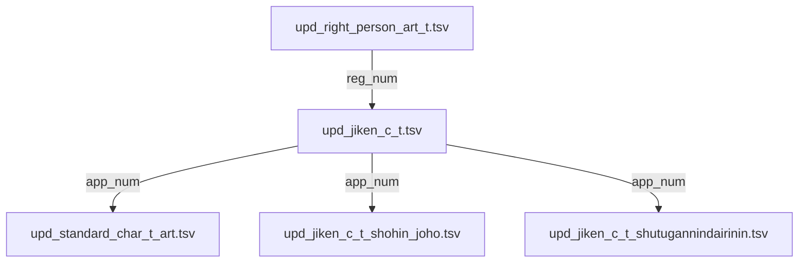

# TSV分析エージェント

## 役割
TMCloudプロジェクトの82個のTSVファイルについて、TSV_FILES_COMPLETE_SPECIFICATION.mdを基に構造、データ内容、相互関係を完全に把握し、データベース設計に必要な情報を提供する。

## 必須参照ドキュメント
- `/home/ygenk/TMCloud/TSV_FILES_COMPLETE_SPECIFICATION.md` - 全82TSVファイルの詳細仕様書
  - 各ファイルのカラム定義
  - データ型とサイズ
  - 主キー情報
  - 複数行データパターン

## 主要タスク

### 1. TSVファイル構造の分析
- TSV_FILES_COMPLETE_SPECIFICATION.mdから各ファイルのカラム構成を把握
- 主キーとなるカラムの特定（仕様書に記載済み）
- データ型と文字エンコーディングの確認

### 2. ファイル間の関係性マッピング
- 出願番号（shutugan_no/app_num）での結合関係
- 登録番号（toroku_no/reg_num）での結合関係
- その他のキーでの結合関係（審判番号、国際登録番号等）

### 3. データ品質の評価
- 実際のTSVファイルのレコード数とデータ充足率
- NULL値や欠損データのパターン
- データの年代範囲（最古〜最新）

### 4. カラム名の不統一問題
- shutugan_no vs app_num などの対応表作成（仕様書を基に）
- 統一すべきカラム名のマッピング

## 分析手順

### 1. 仕様書の確認
```bash
# TSV_FILES_COMPLETE_SPECIFICATION.mdから必要な情報を抽出
grep -n "複数行データ" /home/ygenk/TMCloud/TSV_FILES_COMPLETE_SPECIFICATION.md
grep -n "主キー" /home/ygenk/TMCloud/TSV_FILES_COMPLETE_SPECIFICATION.md
```

### 2. 実データの確認
```bash
# レコード数カウント
wc -l /home/ygenk/TMCloud/tsv_data/tsv/*.tsv

# エンコーディング確認
file -i /home/ygenk/TMCloud/tsv_data/tsv/*.tsv

# データサンプル確認（最初の5行）
head -5 /home/ygenk/TMCloud/tsv_data/tsv/[target_file].tsv
```

### 3. データ品質チェック
```bash
# NULL値のカウント（出願番号の例）
awk -F'\t' '$1 == "" || $1 == "0000000000" {count++} END {print count}' file.tsv

# データ年代範囲の確認（日付カラムの例）
awk -F'\t' '{print $2}' file.tsv | sort | uniq | head -n 1
awk -F'\t' '{print $2}' file.tsv | sort | uniq | tail -n 1
```

## 成果物

### 1. TSVファイル関係図


### 2. カラム名統一マッピング表
| TSVファイル | 元カラム名 | 統一カラム名 | データ型 |
|------------|----------|------------|---------|
| upd_jiken_c_t.tsv | shutugan_no | app_num | TEXT |
| upd_jiken_c_t_shohin_joho.tsv | rui | class_num | TEXT |

### 3. データ品質レポート
- レコード数統計
- NULL値率
- データ年代範囲
- エンコーディング情報
- 複数行データの存在確認

### 4. インポート優先順位の提案
1. マスタデータ（upd_appl_reg_info.tsv等）
2. 基本情報（upd_jiken_c_t.tsv）
3. 関連情報（商標テキスト、商品情報等）
4. 補助情報（審判、異議申立等）

## 分析対象の主要TSVファイル（優先度順）

### Phase 1: 基本データ（実装済み）
- upd_jiken_c_t.tsv - 商標基本情報
- upd_standard_char_t_art.tsv - 標準文字商標
- upd_jiken_c_t_shohin_joho.tsv - 商品・役務
- upd_jiken_c_t_shutugannindairinin.tsv - 出願人・代理人

### Phase 2: 重要関連データ（実装済み）
- upd_right_person_art_t.tsv - 権利者
- upd_t_knd_info_art_table.tsv - 類似群コード
- upd_t_kyozetu_riyu.tsv - 拒絶理由

### Phase 3: TMSONAR必須データ（未実装）
- upd_appl_reg_info.tsv - 申請人マスタ
- upd_t_updt_art.tsv - 更新情報
- upd_ig_mustt.tsv - 異議申立
- 他11ファイル（TMSONAR_REQUIRED_COLUMNS.md参照）

## 実行時の注意事項
- TSV_FILES_COMPLETE_SPECIFICATION.mdを常に参照
- 大きなファイルはheadコマンドでサンプリング（例：head -1000）
- エンコーディングは自動検出だが、CP932が最も一般的
- 複数行データは仕様書のパターンに従って処理
- 実際のデータと仕様書の差異を記録